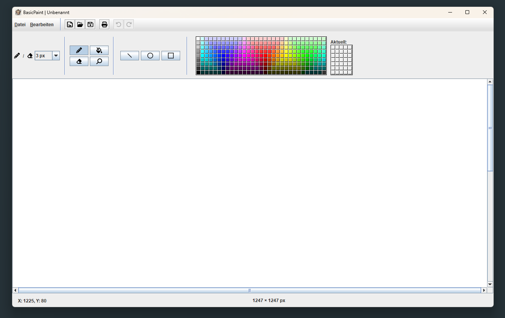
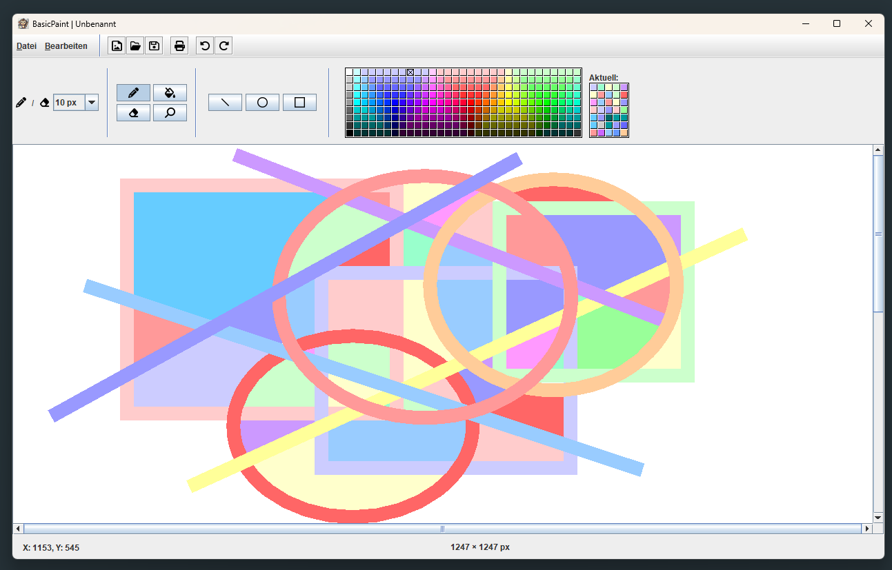
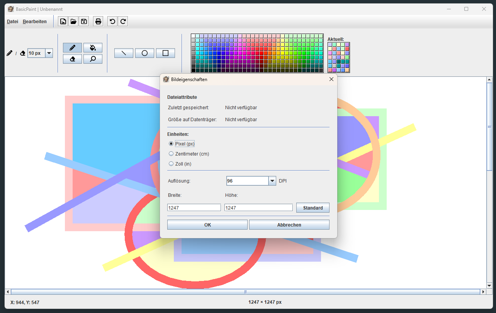

# BasicPaint
A very simple Java Swing drawing application oriented on the example of MS Paint.

// Note: The application is currently only available with a German-language user interface.

## Preview the application:

- The main window with all necessary components for a smooth and intuitive painting process. It contains the following features:

#### Menu bar
Consisting of the following components:
- A 'File' menu with the menu items - new file; open file; save file; save file as; print; image properties;
- An 'Edit' menu with the menu items - undo; redo;
- A toolbar with shortcuts to the menu items - new file; open file; save file; print; undo; redo;

#### Toolbar
Consisting of the following components:
- A combo box to set the brushstroke width
- A section to choose between the painting tools - pencil; eraser; paint bucket (fill); and zoom (not implemented yet - just shows a message that it has not yet been implemented when it is selected for the first time.)
- A section to choose between different shape-tools - line; ellipse; rectangle;
- An implemented colour chooser and its section of the previously selected colours

#### Painting Panel
- The Painting panel holds the painting area which is implemented as a BufferedImage.

#### Status Bar
Consisting of the following components:
- A JLabel to display the current x and y coordinates of the mouse cursor
- Another JLable to display the size of the current painting area in px

- This picture shows an example drawing with the following tools: line, ellipse, rectangle and the fill function using various colours. 

- Here you can see the image properties window. 
- If an existing jpg or png file is loaded into the application, it shows the last saving date and the size on the hard disk as well. If no file is loaded it shows 'Not available'. 
- Besides that it is possible to change the Unit (pixel, centimeter, inch) for setting the size of the drawing area. 
- It is also possible to change the dpi value. 
- All value changes are calculated in real time within the image properties window. 
- As it is to be expected, the 'Standard' button sets the values in the width and height fields back to their default values - 1247 x 1247 px.

## Brief description
BasicPaint is a Java Swing-based paint programme that provides basic drawing functions similar to MS Paint. The aim of the application is to provide a simple graphical user interface that allows users to perform the simplest drawing operations. 
 The basic requirements were that lines, rectangles and ellipses could be drawn freely with the mouse. To extend the functions of these requirements, the options of free drawing, erasing, manually changing the brush size and filling areas were added.
 The toolbar also contains a colour selection menu that allows new colours to be selected without the need for an additional dialog. This menu also contains an overview of the recently used colours.
 A zoom function was also planned, but due to the complexity and technical challenges involved, such as scaling the drawing area, cursor position and brush size, as well as the need to prevent the blurring of the contents of the drawing area when zooming in and out, only an icon button has been added to the program that displays a message once per session indicating that the function is planned but not yet implemented.

Further core requirements were file operations, such as creating new files, as well as saving and loading graphics. These operations were also extended to include the option of printing and an ‘undo and redo’ function. In addition, an image properties dialogue was created that not only allows you to see when the image was last saved and the size used on the hard drive, it also allows you to resize the dimensions of the drawing area.

All relevant file operations are accompanied by dialogue windows. For file operations that would discard the current drawing area, a dialogue window appears if there are any unsaved changes, offering the option to save them.  If the user cancels the save operation, the operation is also cancelled, so that the drawing area can only be discarded by explicitly selecting the ‘No’ button, in other words, by choosing not to save.
  Filters have been implemented for the file selection menus that offer the options of displaying either JPG, PNG, JPG & PNG or all files.

All relevant functions can be accessed via the menu and the toolbar and/or via keyboard shortcuts. This ensures that the programme is practical to use and provides the usual comfort functions of a painting programme.

The clear separation of tasks (drawing area, tool selection, file menu) and the added functions (such as colour selection and undo/redo) meet the core requirements of the task and provide a basis for future enhancements.
